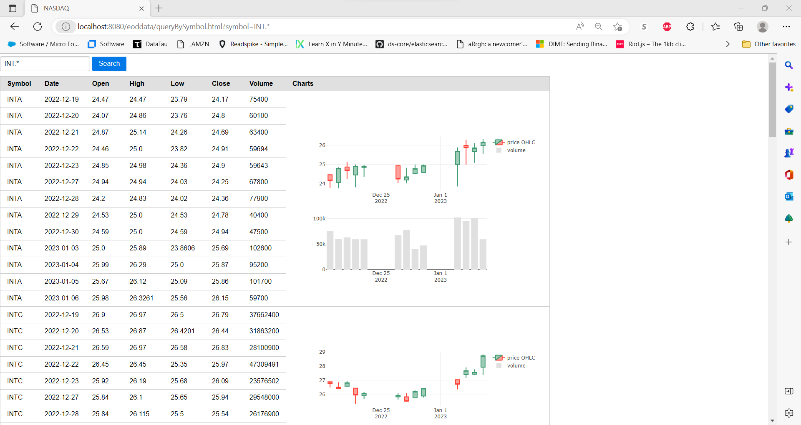

## Small Market Data Server
### Goal: To learn a little about...
1) Gradle
2) Micronaut
3) Tablesaw
4) Java 17
5) Maybe some htmx + thymeleaf

### Endpoints
#### GET
1) /eoddata/head -- returns 10 rows of EOD NASDAQ Data
2) /eoddata/queryBySymbol.txt?symbol=EBAY -- returns rows of EOD NASDAQ Data for the given symbol as text
3) /eoddata/queryBySymbol.html?symbol=EBAY -- returns rows of EOD NASDAQ Data for the given symbol as HTML

### HTML output now includes candlestick charts, courtesy of plotly!

## Micronaut 3.7.5 Documentation

- [User Guide](https://docs.micronaut.io/3.7.5/guide/index.html)
- [API Reference](https://docs.micronaut.io/3.7.5/api/index.html)
- [Configuration Reference](https://docs.micronaut.io/3.7.5/guide/configurationreference.html)
- [Micronaut Guides](https://guides.micronaut.io/index.html)
---

- [Jib Gradle Plugin](https://plugins.gradle.org/plugin/com.google.cloud.tools.jib)
- [Shadow Gradle Plugin](https://plugins.gradle.org/plugin/com.github.johnrengelman.shadow)
## Feature http-client documentation

- [Micronaut HTTP Client documentation](https://docs.micronaut.io/latest/guide/index.html#httpClient)

## Feature views-thymeleaf documentation

- [Micronaut Thymeleaf Views documentation](https://micronaut-projects.github.io/micronaut-views/latest/guide/index.html#thymeleaf)

- [https://www.thymeleaf.org/](https://www.thymeleaf.org/)

## Feature test-resources documentation

- [Micronaut Test Resources documentation](https://micronaut-projects.github.io/micronaut-test-resources/latest/guide/)

## Feature mockito documentation

- [https://site.mockito.org](https://site.mockito.org)

